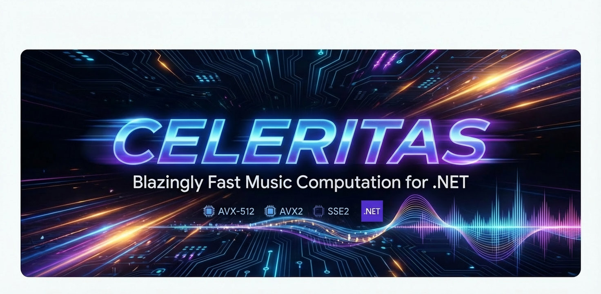

# Celeritas

> **Celeritas** (Latin: *swiftness*) — High-Performance Music Engine for .NET
>
> **Author:** Vladimir V. Shein

[](https://dotnet.microsoft.com/)
[](LICENSE.md)
[]()
[](https://github.com/sheinv78/Celeritas/actions/workflows/ci.yml)
[](https://github.com/sheinv78/Celeritas/actions/workflows/python-ci.yml)

<p align="center">
  
</p>

## What is Celeritas?

Celeritas is a high-performance **symbolic music analysis and generation engine** focused on harmony, structure, and algorithmic composition. It leverages SIMD instructions (AVX-512, AVX2, SSE2, NEON) for maximum performance.

**This is NOT:**

- ❌ A DAW (Digital Audio Workstation)
- ❌ A VST plugin
- ❌ A synthesizer or audio engine

**This IS:**

- ✅ A symbolic music computation library
- ✅ A music theory analysis toolkit
- ✅ An algorithmic composition engine
- ✅ A research and educational tool

## Project Status

🚧 **Active Development** — Experimental / Research Project  
⚠️ **API is not stable yet** — Breaking changes may occur

Current version: **v0.9.0** (December 2025)  
**350 tests** passing (C#) + **35 tests** (Python)

## Intended Use Cases

### ✅ Primary Use Cases

- **Symbolic music analysis** — Chord identification, key detection, harmonic analysis
- **Algorithmic composition** — Auto-harmonization, melody generation, progression analysis
- **Music theory research** — Modal analysis, voice leading, counterpoint, form analysis
- **Offline batch processing** — MIDI file analysis and transformation
- **Educational tools** — Music theory learning applications
- **DAW integration** — Backend for compositional assistants via MIDI export
- **Notation software backends** — Harmonic analysis for score editors

### ⚠️ Not (Yet) Intended For

- Real-time audio synthesis
- Live performance (latency-sensitive operations)
- Audio signal processing (DSP)
- Spectral analysis (audio → symbolic is out of scope)

## 🎯 Performance

Celeritas is designed for extreme performance.

Benchmark numbers below are example measurements on AMD Ryzen 9 7900X (.NET 10, AVX-512). Results vary by CPU, OS, .NET version, and workload:

```text
Transpose_1M_Notes        : 29.5 µs   (~34 ns/note,  ~34 million notes/sec)
Transpose_10M_Notes       : 742 µs    (~74 ns/note,  ~13 million notes/sec)
ChordAnalysis_GetMask     : 1.0 ns    (bit mask generation)
ChordAnalysis_Identify    : 1.7 ns    (chord identification from mask)
MusicNotation_ParseSingle : 12.2 ns   (parse "C#4" → pitch)
Progression_Analyze       : 2.3 µs    (full harmonic analysis)
Quantize_1M_Notes         : 1.29 ms   (rhythmic quantization)
```

Run benchmarks:

```bash
dotnet run --project src/Celeritas.Benchmarks -c Release
```

## ✨ Features

### Core Engine

- **⚡ SIMD-Accelerated** — Auto-detection and optimized code paths for AVX-512, AVX2, SSE2
- **🎵 NoteBuffer** — Efficient note storage with rational time representation
- **📐 Rational Arithmetic** — Precise fractional time without floating-point errors (auto-normalized)
- **🎼 Music Notation** — Human-friendly parsing: `"C4/4 [E4 G4]/4 G4/2."` supports notes, chords, rests
- **🎹 Chord Notation** — Multiple simultaneous notes: `[C4 E4 G4]/4` or `(C4 E4 G4):q`
- **🧮 Note Arithmetic** — `PitchClass`, `ChromaticInterval`, `SpnNote` for mod-12 pitch classes, intervals, and SPN notes
- **⏸️ Rest Support** — Explicit rest notation with `R/4`, `R:q`, etc.
- **🔗 Tie Support** — Merge notes across beats/measures with `C4/4~ C4/4` → single note
- **🎶 Polyphony** — Independent voices: `<< bass | melody >>` for piano, SATB, counterpoint
- **🎯 Time Signatures** — Support for 4/4, 3/4, 6/8, and any custom meter
- **📏 Measure Validation** — Parse measures with `|` bars and validate durations match time signature
- **🎵 Directives** — BPM, tempo character (Presto, Vivace), sections, parts, dynamics
- **⚡ Tempo Control** — BPM with ramps: `@bpm 120 -> 140 /2` (accelerando/ritardardo)
- **🔊 Dynamics** — Volume levels (pp, mf, ff), crescendo/diminuendo with `@dynamics`, `@cresc`, `@dim`
- **🔄 Round-Trip Formatting** — Export to notation: `FormatNoteSequence`, `FormatWithDirectives` with chord grouping
- **🚀 AOT-Ready** — Native AOT compilation support for minimal overhead

### Harmonic Analysis

- **🎹 Chord Recognition** — Common chord qualities (triads, sevenths, sus, power/quartal, add9/add11, 7♭5), plus inversions
- **🧾 Chord Symbols (ANTLR)** — Parse chord symbols into pitches: `Dm7`, `C7(b9,#11)`, `C7+5`, `C|G`, `C/E`
- **🎼 Key Detection** — Krumhansl-Schmuckler profiling, parallel keys, relative keys
- **🔄 Modulation Analysis** — Distinguish tonicization vs modulation (direct, via dominant, enharmonic)
- **🎭 Modal System** — 19 modes (Ionian→Locrian, melodic/harmonic minor, blues scales)
- **📊 Progression Analysis** — Roman numerals, tension curves, chord recommendations
- **🧭 Harmony Utilities** — Circle of fifths + functional progressions (ii–V–I, turnaround, full circle, secondary dominants)
- **🎨 Chord Character** — Emotional classification (Stable, Warm, Dreamy, Tense, Dark, Heroic...)
- **📝 Progression Reports** — Detailed human-readable analysis with cadence detection

### Melody Harmonization

- **🎹 Auto-Harmonization** — Viterbi/DP algorithm for optimal chord selection
- **🔌 Pluggable Strategies** — Custom chord candidates, transition scoring, harmonic rhythm
- **⚖️ Cost Optimization** — Balances melody fit, voice leading, and harmonic function

### Counterpoint & Voice Leading

- **🎤 Voice Separation** — Automatic polyphonic voice separation (SATB)
- **🔗 Voice Leading Solver** — Parallel SATB voicing solver (dynamic programming + smoothness heuristic)
- **🎯 Roman Numeral Analysis** — Chord function in key context (I, ii, V7, etc.)
- **⚠️ Rule Checking** — Parallel 5th/octave detection, hidden perfects, spacing rules

### Rhythm Analysis

- **🥁 Meter Detection** — Auto-detect time signature (4/4, 3/4, 6/8...) with confidence
- **🎵 Pattern Recognition** — Tresillo, Habanera, Clave, Shuffle, Bossa Nova
- **📈 Prediction** — Markov chains for style-based rhythm generation (classical, jazz, rock, latin)
- **🔀 Syncopation** — Syncopation and swing analysis
- **🎚️ Groove** — Groove feel (Straight/Swing/Shuffle/Latin/Compound) and drive (0-1)

### Melodic Analysis

- **📈 Contour** — Ascending, Descending, Arch, Bowl, Wave, Static, Complex
- **🎯 Ambitus** — Range analysis with characterization
- **🔍 Motif Detection** — Automatic discovery of recurring patterns
- **📊 Interval Statistics** — Steps vs leaps, interval histogram

### Form Analysis

- **📝 Phrase Segmentation** — Automatic phrase boundary detection
- **🎼 Cadence Detection** — Authentic, Plagal, Deceptive, Half, Phrygian cadences
- **🏗️ Section Detection** — A/B/A' formal structure recognition (Jaccard similarity)
- **📊 Period Detection** — Antecedent-consequent phrase pairs

### MIDI I/O

- **📥 Import** — Load MIDI files into NoteBuffer
- **📤 Export** — Save NoteBuffer to Standard MIDI files
- **🧩 Utilities** — Clone, merge, split (track/channel), and statistics
- **⏱️ Timing Events** — Tempo and time signature events read/write

### Pitch Class Set Analysis

- **🔢 Normal Order & Prime Form** — Atonal music analysis
- **📊 Interval Vector** — Interval class content
- **🔄 Transposition & Inversion** — Tn and TnI operations
- **📚 Forte Catalog** — Pluggable JSON catalog for set identification

## 🚀 Quick Start

### Installation

#### Library (for developers)

```bash
dotnet add package Celeritas
```

Or via NuGet Package Manager:

```powershell
Install-Package Celeritas
```

#### CLI Tool (for end users)

```bash
# Install globally
dotnet tool install --global Celeritas.CLI

# Use from anywhere
celeritas --version
celeritas analyze --notes C4 E4 G4
```

Update to latest version:

```bash
dotnet tool update --global Celeritas.CLI
```

## 📘 Documentation

### Quick Start Examples

**Parse music notation:**

```csharp
using Celeritas.Core;

// Simple notes
var notes = MusicNotation.Parse("C4 E4 G4 B4");

// With durations and chords
var melody = MusicNotation.Parse("C4/4 [E4 G4]/4 G4/2.");

// Time signatures and measures
var song = MusicNotation.Parse("4/4: C4/4 E4/4 G4/4 C5/4 | D4/1");

// With directives (tempo, dynamics)
var result = MusicNotationAntlrParser.Parse(
    "@bpm 120 @dynamics mf C4/4 E4/4 G4/4");
```

**Analyze chords and keys:**

```csharp
using Celeritas.Core.Analysis;

// Chord identification
var chord = ChordAnalyzer.Identify("C4 E4 G4 B4");
Console.WriteLine(chord);  // Output: Cmaj7

// Key detection
var melody = MusicNotation.Parse("C4/4 D4/4 E4/4 F4/4 G4/4");
var key = KeyAnalyzer.DetectKey(melody);
Console.WriteLine(key);  // Output: C major

// Modal analysis
var scale = MusicNotation.Parse("D4 E4 F4 G4 A4 B4 C5 D5");
var mode = ModeLibrary.DetectModeWithRoot(scale);
Console.WriteLine(mode);  // Output: D Dorian
```

**Parse chord symbols (ANTLR):**

```csharp
using Celeritas.Core.Analysis;

var pitches1 = ProgressionAdvisor.ParseChordSymbol("C7(b9,#11)");
var pitches2 = ProgressionAdvisor.ParseChordSymbol("C7+5");
var pitches3 = ProgressionAdvisor.ParseChordSymbol("C|G");   // polychord layering
var pitches4 = ProgressionAdvisor.ParseChordSymbol("C/E");   // slash bass

Console.WriteLine(string.Join(" ", pitches1));
```

**Note arithmetic (pitch classes, intervals, scientific pitch notation):**

```csharp
using Celeritas.Core;

// Pitch-class arithmetic wraps modulo 12
var pc = PitchClass.C;
var d = pc + 2;
Console.WriteLine(d);              // D

// Differences return intervals
var asc = PitchClass.C - PitchClass.B;                    // +1 (ascending wrap)
var shortest = PitchClass.C.SignedIntervalTo(PitchClass.B); // -1 (shortest signed)
Console.WriteLine(asc.SimpleName);        // m2
Console.WriteLine(shortest.Semitones);    // -1

// Notes with octave (SPN) + transposition
var c4 = SpnNote.C(4);
var e4 = c4 + ChromaticInterval.MajorThird;
Console.WriteLine(e4); // E4

// Control enharmonic spelling when formatting
Console.WriteLine(SpnNote.CSharp(4).ToNotation(preferSharps: false)); // Db4
```

### 📚 Complete Documentation

- **[Examples](examples/)** - Working code samples organized by topic
  - [Notation Basics](examples/01-notation-basics.cs) - Parsing, chords, rests, ties
  - [Round-Trip Formatting](examples/02-round-trip.cs) - Export back to notation
  - [Directives](examples/03-directives.cs) - Tempo, dynamics, sections
  - [Chord Analysis](examples/04-chord-analysis.cs) - Identification and inversions
  - And more...

- **[Cookbook](docs/COOKBOOK.md)** - Common patterns and recipes
  - Quick start recipes
  - Chord and key analysis
  - Harmonization workflows
  - MIDI processing
  - Performance optimization

- **[Python Guide](bindings/python/README.md)** - Using Celeritas from Python

## 🔧 CLI Tool

```bash
# Chord analysis
celeritas analyze --notes C4 E4 G4 B4

# Key detection
celeritas keydetect --notes C4 E4 G4 B4 D5

# Mode detection
celeritas mode --notes C D Eb F G A Bb

# Progression analysis
celeritas progression --chords Dm7 G7 Cmaj7 Am7

# MIDI file analysis
celeritas midi analyze --in song.mid

# Transpose notes or MIDI
celeritas transpose --semitones 5 --notes C4 E4 G4
celeritas midi transpose --in song.mid --out transposed.mid --semitones 2

# Export to MIDI
celeritas midi export --out output.mid --notes "4/4: C4/4 E4/4 G4/4"

# System info
celeritas info
```

For complete CLI documentation, see `celeritas --help`.

## 🏗️ Building from Source

Requirements:

- .NET 10.0 SDK or later
- CPU with SSE2 (minimum), AVX2 or AVX-512 (recommended)

```bash
git clone https://github.com/sheinv78/Celeritas.git
cd Celeritas
dotnet build
dotnet test
```

### Native AOT Compilation

```bash
dotnet publish src/Celeritas.CLI -c Release -r win-x64
dotnet publish src/Celeritas.CLI -c Release -r linux-x64
dotnet publish src/Celeritas.CLI -c Release -r osx-arm64
```

## 🧪 Testing

```bash
# C# tests
dotnet test

# Python tests
cd bindings/python
python test_celeritas.py
```

**Current:** 350 C# tests + 35 Python tests, all passing

## 🎉 Recent Updates (v0.9.0 - December 2025)

Highlights:

- ✅ **Ornamentation** - Trills, mordents, turns, appoggiaturas
- ✅ **Figured Bass** - Baroque chord notation realization
- ✅ **ARM NEON SIMD** - High-performance on Apple Silicon and ARM64
- ✅ **WebAssembly SIMD** - Browser-based music processing
- ✅ **Python Bindings** - Full ctypes wrapper with 35 passing tests
- ✅ **Round-Trip Formatting** - Export notes with directives back to notation

## 🔭 Next Ideas

- Expand MIDI transformations (track/channel workflows, musical merges, timing edits)
- Add more CLI commands/examples around rhythm & groove analysis
- Improve documentation coverage (Cookbook recipes, API notes, performance tips)
- Add more test-data samples and stress tests for edge cases
- Continue performance work (benchmarks, allocations, SIMD paths)

### 📊 SIMD Platform Support

| Platform        | SIMD     | Status | Performance      |
|-----------------|----------|--------|------------------|
| x64 Intel/AMD   | AVX-512  | ✅     | ~34M notes/sec   |
| x64 Intel/AMD   | AVX2     | ✅     | ~13M notes/sec   |
| x64 Intel/AMD   | SSE2     | ✅     | ~10M notes/sec   |
| ARM64           | NEON     | ✅     | ~10-15M notes/sec|
| WebAssembly     | SIMD128  | ✅     | ~5-10M notes/sec |
| Fallback        | Scalar   | ✅     | ~1M notes/sec    |

## 📄 License

Licensed under the [Business Source License 1.1 (BSL-1.1)](LICENSE.md).

Change Date: 2030-01-01 (then: Apache-2.0)

Until the Change Date, commercial production use requires a commercial license.

- ✅ Free for non-commercial use
- ✅ Free for open source projects
- ⚠️ Commercial use requires a license

For commercial use, [contact us](https://github.com/sheinv78/Celeritas/issues).

### License FAQ (short)

- **Can I use this for learning / research / personal projects?** Yes.
- **Can I use this in an open-source project?** Yes, if your project is distributed under an OSI-approved license.
- **Can I use this in a commercial product or service?** Not without a commercial license (until the Change Date).
- **What happens on the Change Date?** On 2030-01-01, Celeritas becomes available under Apache-2.0.
- **Not sure if your use is commercial?** Please open an issue and describe your use case.

## 📚 Dependencies

Celeritas uses the following third-party libraries:

### DryWetMIDI

- **[Melanchall.DryWetMIDI](https://github.com/melanchall/drywetmidi)** 8.0.3
- **License:** MIT License
- **Copyright:** © Maxim Dobroselsky
- **Purpose:** MIDI file import/export

### ANTLR 4

- **[Antlr4.Runtime.Standard](https://github.com/antlr/antlr4)** 4.13.1
- **License:** BSD-3-Clause License
- **Copyright:** © 2012-2022 The ANTLR Project
- **Purpose:** Music notation parser generation

All other functionality (SIMD acceleration, harmonic analysis, voice leading, rhythm analysis, etc.) is implemented natively in Celeritas.

## 🤝 Contributing

Contributions are welcome! Please feel free to submit a Pull Request.

1. Fork the repository
2. Create your feature branch (`git checkout -b feature/amazing-feature`)
3. Commit your changes (`git commit -m 'Add some amazing feature'`)
4. Push to the branch (`git push origin feature/amazing-feature`)
5. Open a Pull Request

### Development Setup

```bash
git clone https://github.com/sheinv78/Celeritas.git
cd Celeritas
dotnet restore
dotnet build
dotnet test
```

### Publishing (Maintainers)

Releases are automated via GitHub Actions:

1. **Development builds** - Automatic on push to main
2. **Stable releases** - Create a tag:

   ```bash
   git tag v0.9.0
   git push origin v0.9.0
   ```

This triggers:

- ✅ Build on Ubuntu, Windows, macOS
- ✅ Run all tests
- ✅ Create NuGet packages
- ✅ Publish to NuGet.org (on tag)
- ✅ Create GitHub Release with artifacts

**Note:** Set `NUGET_API_KEY` secret in GitHub repository settings.

## 📧 Contact

- **GitHub Issues:** Bugs and feature requests
- **Email:** [sheinv78@gmail.com](mailto:sheinv78@gmail.com)

---

Made with ⚡ and 🎵
